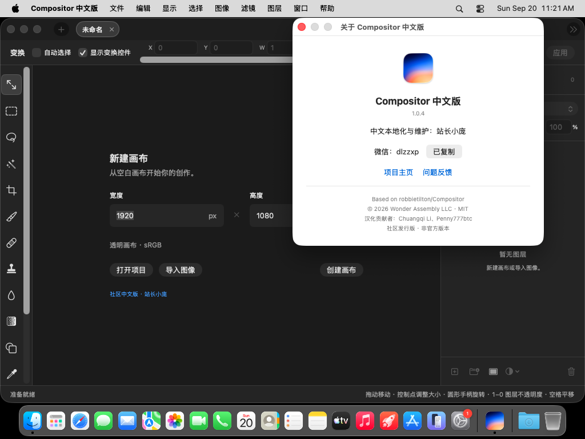
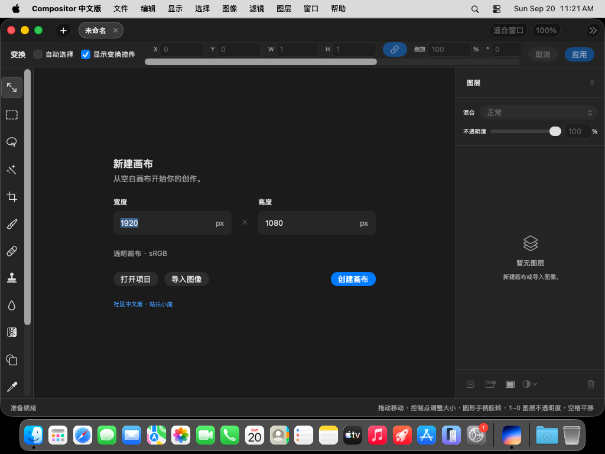
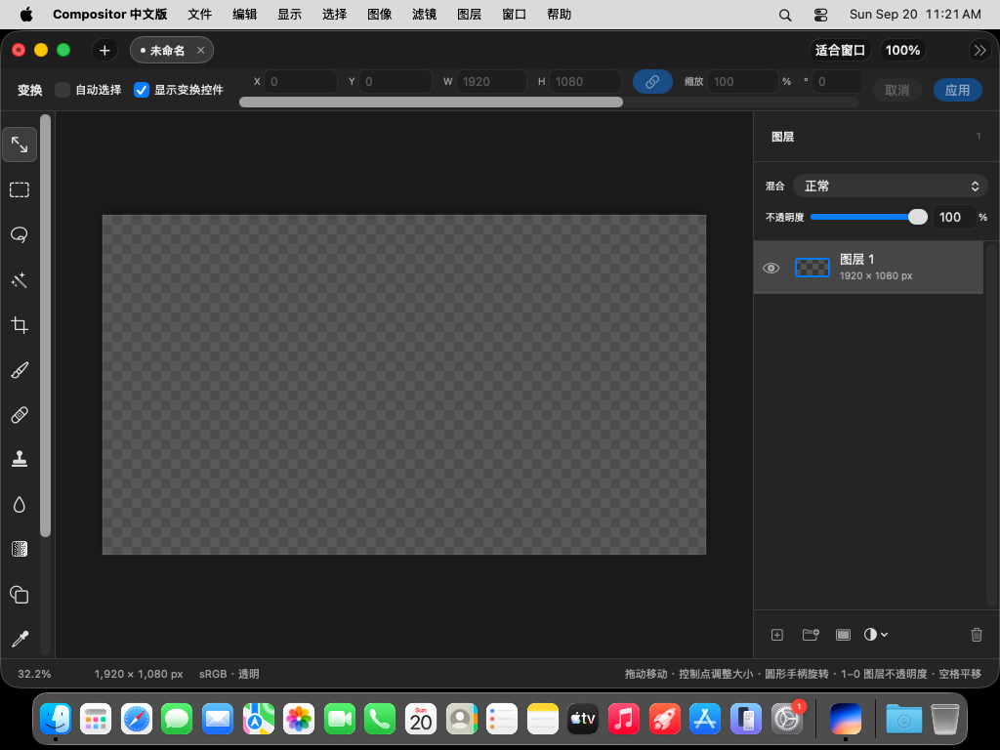

# 简体中文验证记录

## 社区体验版 v1.0.4-cn.1

2026-09-20，发布源码 `a4ef1d071ebcc9de976e61bcf7740bc156ac44ec` 的 [GitHub 构建、测试与打包全部通过](https://github.com/JeyooZ/Compositor-CN/actions/runs/35507792906)。

- Debug 和 Release 构建通过；英文、中文各 25 项定向测试通过。
- 中文 UI 测试验证署名入口、关于窗口维护者及微信号、复制按钮成功状态、关闭窗口和创建画布。
- 人工检查关于窗口、新建画布截图，文字和操作均可见，无明显截断；应用菜单栏显示“Compositor 中文版”。
- ARM64 DMG 已下载到本机，SHA-256、hdiutil 完整性验证和 codesign 严格验证通过。核对应用标识、最低系统 26.5、Applications 入口及 MIT 许可证。
- 本地 Finder 查看安装窗口，标题与维护者背景、应用及 Applications 入口均已设置。本机开启显示隐藏文件，会额外显示磁盘内部目录；macOS 15 上应用图标有不兼容标志，符合最低系统限制。
- 安装包为临时签名、未 Apple 公证。未在本机 macOS 15 运行，也未宣称完成全部功能测试。原生 macOS 桌面应用不适用网页 360px/390px 和 DOM 检查。

[下载此体验版](https://github.com/JeyooZ/Compositor-CN/releases/tag/v1.0.4-cn.1)

## 首轮汉化验证

2026-09-20，源码提交 `705ca88` 的 [CI 验证通过](https://github.com/JeyooZ/Compositor-CN/actions/runs/35506437491)。

- Debug 应用构建通过。
- 562 条界面资源、3 条文件类型资源通过语法、重复键、中英文键一致性及格式参数检查。
- 英文、简体中文分别通过 25 项定向测试，覆盖本地化查找与回退、用户内容格式化、枚举存储值、混合模式选择、项目读写、画布尺寸、图像尺寸和裁剪。
- 中文 UI 测试通过：启动、验证“创建画布”按钮中文、创建画布并验证编辑画布出现。
- 人工查看 CI 截图，确认新建画布、主编辑界面和图层面板显示中文，首次启动不再出现官方更新提示。

这不是完整测试套件或全部弹窗的视觉验收。尚未逐项验证所有滤镜、蒙版、拖放及异常路径的界面；尚未制作签名、公证发行包。本机 macOS 15.3.1 无法运行要求 macOS 26.5 的当前项目，构建与运行验证在 GitHub macOS runner 上完成。

## 复用来源

- 基础：Chuangqi Li 的上游 PR #29，原提交 `8edb736`，以 cherry-pick 保留作者与来源记录。
- 参考：Penny777btc 的上游 PR #21，复用工具提示拆分结构并适配现有资源键。
- 补充：Finder 文档类型本地化、默认保存文件名本地化、社区应用标识、停用官方更新、资源验证及中文 UI 自动化。
- 修复上游测试过期 API：SubjectRemoval 的 settings 参数、图层移动接口、选区光标表。没有通过排除源文件绕过这些编译问题。

## 截图

